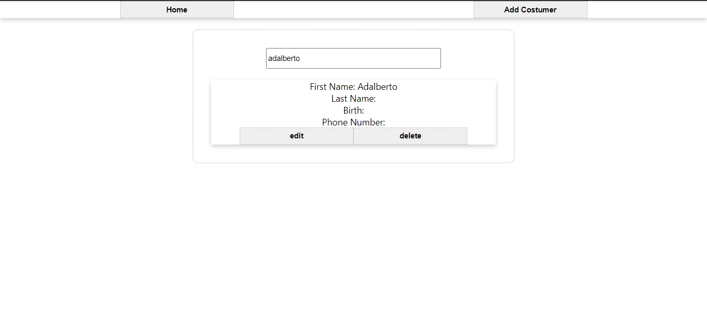
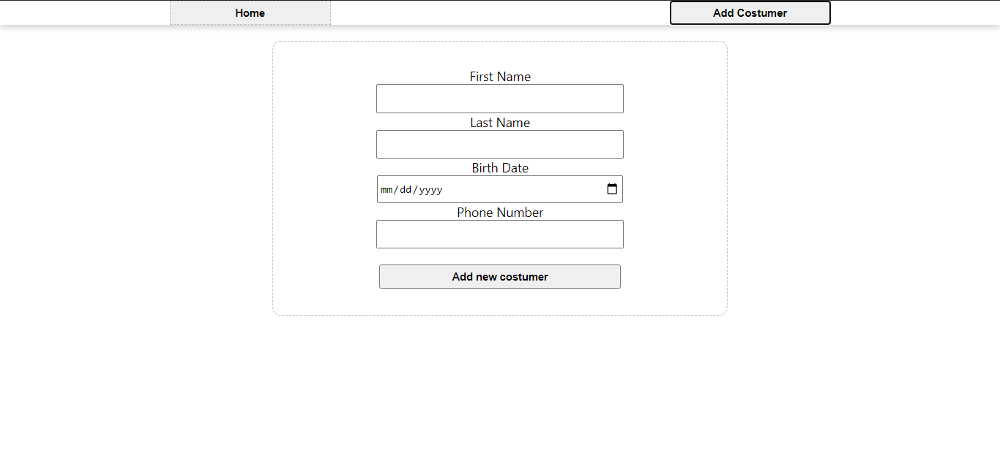

# costumer control
#### demo project with  react and redux

Costumers are stored in redux
in /AddUsers/index.tsx I insert a new costumer
in /Edit/index.tsx I edit the costumer based on the index of that costumer in the array
in /Users/index.tsx I get all costumers in the reducer and if there is a search I'll try to find the one that best fits de query (by first name or last name)

